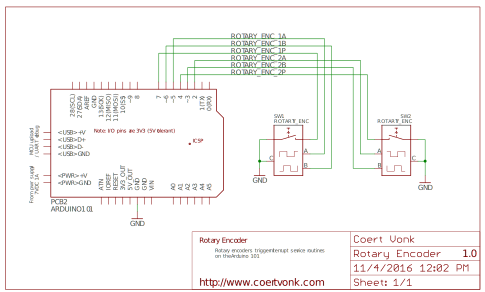

# Rotary Encoder for Arduino101  
##Using interrupts and allowing multiple instances

This library supports rotary encoders connected to the Arduino/Genuino 101.  It should work for other microcontrollers for as long as they can generate the necessary interrupts.

Features:

* interrupt driven, no polling needed
* allows for more than one instance

Assumptions:

* The common pins of the rotary encoder are connected to ground, and the remaining pins to GPIO ports

Many sketches exist for the Arduino UNO, most of them only supporting a single rotary encoder.   I borrowed from [one of them](http://www.instructables.com/id/Improved-Arduino-Rotary-Encoder-Reading/), and adapted it for Arduino/Genuino 101.

The challenge was for the interrupt service routines to invoke a C++ Class Member Function.  The solution chosen relies on virtual functions and friend classes used as described in the article [Interrupts in C++](http://www.embedded.com/design/prototyping-and-development/4023817/Interrupts-in-C-) by Alan Dorfmeyer and Pat Baird.

More projects can be found at [coertvonk.com](http://www.coertvonk.com/technology/embedded).
